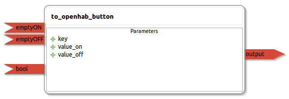

to_openhab_button
====================

General description
---------------------
The to_openhab_button package

Node: to_openhab_button
---------------------
#### Parameters
**key** *(string, default: )*
<!--- protected region key on begin -->
<!--- protected region key end -->

**value_on** *(string, default: )*
<!--- protected region value_on on begin -->
<!--- protected region value_on end -->

**value_off** *(string, default: )*
<!--- protected region value_off on begin -->
<!--- protected region value_off end -->

#### Published Topics
**output** *(diagnostic_msgs::KeyValue)*   
<!--- protected region output on begin -->
<!--- protected region output end -->

#### Subscribed Topics
**emptyON** *(std_msgs::Empty)*   
<!--- protected region emptyON on begin -->
<!--- protected region emptyON end -->

**emptyOFF** *(std_msgs::Empty)*   
<!--- protected region emptyOFF on begin -->
<!--- protected region emptyOFF end -->

**bool** *(std_msgs::Bool)*   
<!--- protected region bool on begin -->
<!--- protected region bool end -->

