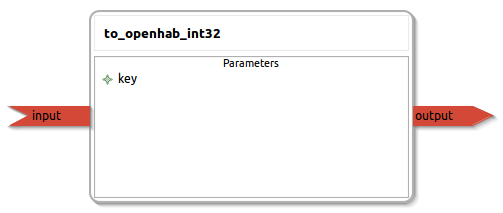

to_openhab_int32
====================

General description
---------------------
The to_openhab_int32 package

Node: to_openhab_int32
---------------------
#### Parameters
**key** *(string, default: )*
<!--- protected region key on begin -->
<!--- protected region key end -->

#### Published Topics
**output** *(diagnostic_msgs::KeyValue)*   
<!--- protected region output on begin -->
<!--- protected region output end -->

#### Subscribed Topics
**input** *(std_msgs::Int32)*   
<!--- protected region input on begin -->
<!--- protected region input end -->

